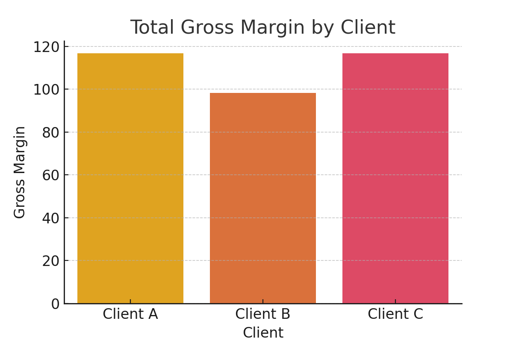
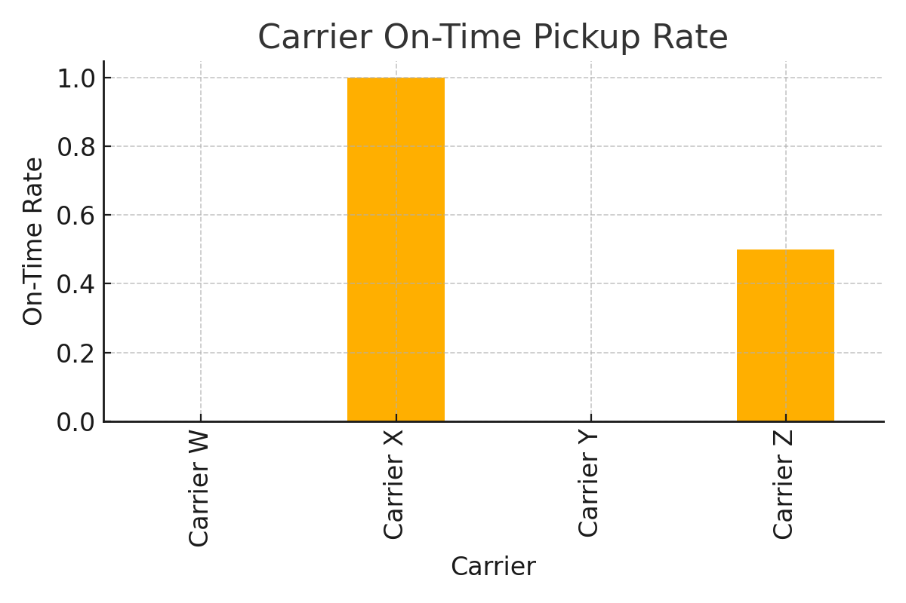

# 🚛 TQL FreightFlow Dashboard – Built by Dadi Naveen

---

## 💡 What is this project?

This is a freight insights dashboard built to help TQL sales reps make faster, smarter decisions. It gives a clear view of how loads are performing — which clients are profitable, which carriers are reliable, and where issues are happening — all in one place.

---

## 🎯 Why did I build this for TQL?

At TQL, sales is fast, competitive, and full of moving parts. I built this because I know how stressful it can be to manage 80+ calls a day, chase carriers, and keep clients happy.

This dashboard helps reps:
- 🔎 Spot problems before they cost a deal
- 💼 Focus time on the right clients
- 🚫 Avoid unreliable carriers
- ⏱️ Save time during follow-up calls

> **“Sales is not about selling anymore — it's about helping.”**

That’s what this dashboard does: it helps the rep help the customer, faster.

---

## ⚙️ How it works for TQL:)

I created a sample freight dataset that includes:
- Client names  
- Carrier names  
- Pickup and delivery status  
- Gross margin per load

Then I turned this into **3 powerful dashboards** using clean visuals and simple logic that any rep can use — no tech skills needed.

---

## 📊 Dashboards

### 1️⃣ Gross Margin by Client

💰 **What it shows:** Who your best-paying clients are.  
🎯 **Why it matters:** Focus on clients who bring the most value. Spend your hustle where it counts.

> 🔁 *“I’d rather make 5 great calls than 50 random ones.”*  
> This chart helps you do that.

---

### 2️⃣ Carrier On-Time Pickup Rate

🚚 **What it shows:** Which carriers are picking up loads on time.  
🛠️ **Why it matters:** Late pickups cost deals. Use this to avoid delays and build trust.

> ❗ *“In sales, you’re only as strong as your weakest follow-through.”*

Real Example: At Amazon, I saw how one late delivery created a ripple effect across 4 teams. With this chart, you stay ahead of that ripple.

---

### 3️⃣ Pickup Issues by Client

⚠️ **What it shows:** Clients with repeated pickup problems.  
📞 **Why it matters:** Proactive follow-ups save relationships. Catch it before they call you angry.

> 📣 *“The best salespeople solve problems before the client even notices.”*

Real Example: At NYU, I created inventory dashboards to catch supply issues early. That experience inspired this.

---

## 🧠 What this project teaches

- Sales isn’t just about closing — it’s about awareness  
- Small data points can unlock big opportunities  
- You win more when you follow up smarter

This dashboard is my way of saying:  
**“I get what this role takes — and I’m ready for it.”**

---

## 👨‍💻 About Me

**Name:** Dadi Naveen  
**Location:** Baltic, CT  
**Email:** dadi@credxusa.com  
**GitHub:** [github.com/dadinaveen1729](https://github.com/dadinaveen1729)  
**LinkedIn:** [linkedin.com/in/naveendadi](https://linkedin.com/in/naveendadi)

With 4+ years in logistics, analytics, and client operations — from Amazon to Infosys to NYU — I’ve lived the real pressure behind the scenes. Now I’m excited to bring that same energy and speed into sales.

---

## 💬 Final Words

Thanks for reviewing this project. I didn’t build it just to impress — I built it to show how I solve problems, how I think like a rep, and how I’m already aligned with TQL’s mindset.

> 🧱 *“Hard work beats talent when talent doesn’t work hard.”*  
> I’m ready to outwork, outlearn, and outperform.

Let’s build something big together.
